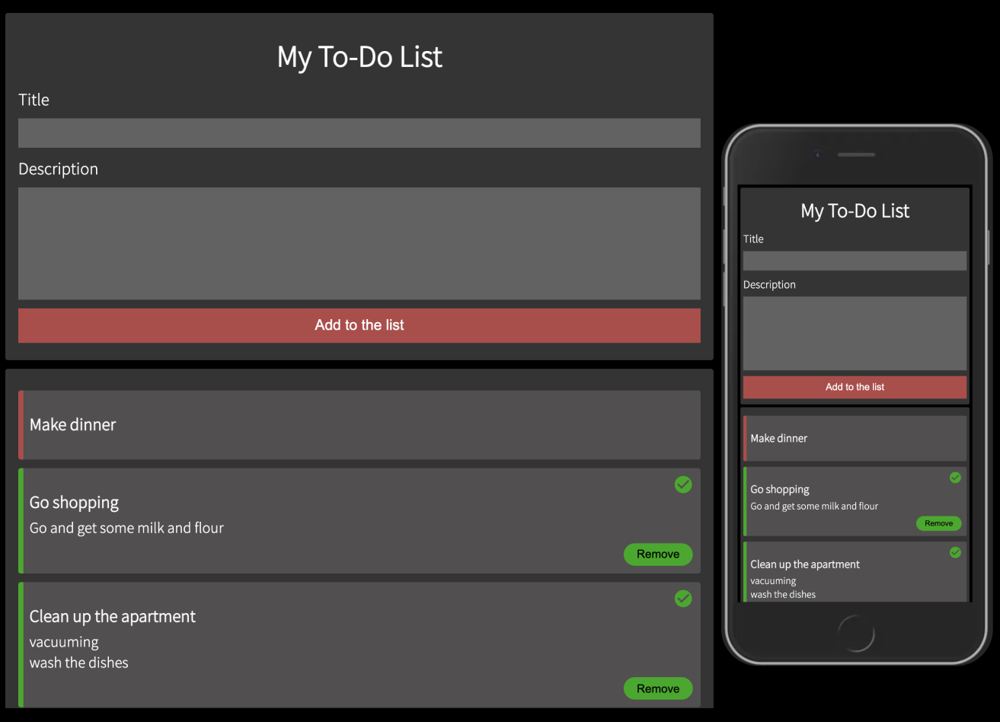

# React To-Do List

This To-Do list was created for a weekend test from </salt> School of applied technology

## technical specifications / requirements

## UI specifications. 
- There MUST be a form input where the user can add a new todo.
- On first load the list of todos MUST be empty.
- When the user submits a new todo from the form the todo card MUST appear in the list.
- Each todo card MUST be toggleable between 'done' and 'not done'.
- There MUST be a remove-button on cards that are 'done' and when the user clicks the button it will be removed from the list completely.
- Todo cards which are set to 'done' MUST appear on the bottom of the list, and they SHOULD be easy to visually separate.
- The original order of the cards MUST be maintained if you toggle a card to 'done' and then back again.
- It SHOULD be easy to add, toggle and remove todo's. For example adding a new card by hitting 'enter'. 

## Technical specifications. 

- You MUST keep the todo-list in a state object, you can choose yourself where this should reside.
- You MUST use at least 3 levels of components. In the simplest case this would be an App component in which you have a TodoList component containing TodoCard components.
- You MUST use props for passing the necessary information to the todo components.
- You MUST use Semantic html elements.
- You MUST use a clear naming strategy for your css and class names.
- You SHOULD use BEM.
- You SHOULD have a mobile first approach.
- You SHOULD have suitable tests.
- You MUST NOT use React Router, Hooks nor Redux.


## Installation

Install all dependencies.  

```bash
npm install
```

## Usage

```bash
npm start
```

npm run dev is starting the application on localhost:3000

## Preview

|  |
|:---:|
| Preview of the To-Do List |
